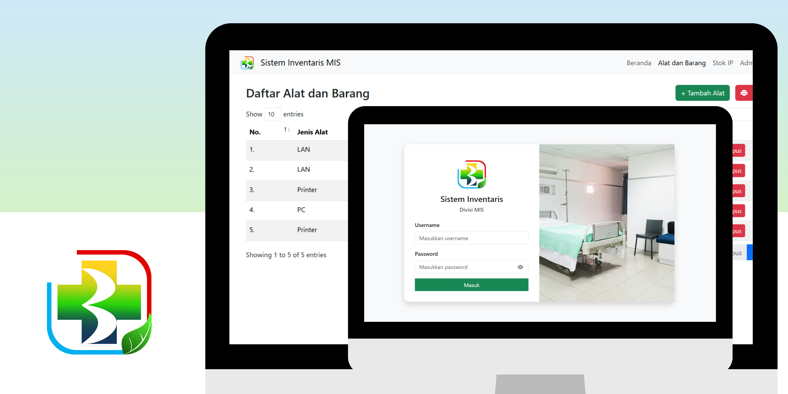

<div id="start-of-content" align="center">


##

### SIMIS, MIS Division Inventory System

</div>

## 📙 Description

SIMIS is an application designed to simplify the management of procurement equipment and goods data administered by the MIS Division. This application provides a solution for Bengkalis Regional Hospital in storing, organizing and monitoring equipment and goods inventory in a structured and efficient manner. Apart from managing inventory data, SIMIS also provides a feature for recording IP addresses at each polyclinic, making it easier to monitor the hospital's internal network. The output of this application is a structured report in the form of a PDF file, which can be accessed for documentation and audit purposes. With SIMIS, inventory management becomes more efficient, transparent and accountable, thereby supporting better operational processes at Bengkalis Regional Hospital.



## 📖 Features

Interesting features of SIMIS:

1. **Authentication**: Admins can log in to the application via a registered account.

2. **CRUD Data**: Can add, view, change, search and delete data on procurement of equipment and goods and tools as well as record the IP list for each polyclinic available at Bengkalis Regional Hospital.

3. **Print PDF**: Can print PDF files for data on equipment and procurement items at Bengkalis Regional Hospital.

4. **UUID**: Each equipment and goods procurement data entry is equipped with a UUID (Universal Unique Identifier). This UUID functions as a unique identifier to ensure that each data has no conflicts or duplications, especially during the data import/export process or integration with other systems.

## 🛠️ Project Installation Guide

Following are the steps to install a Laravel project:

### Prerequisites

Make sure you have [Node.js](https://nodejs.org/) and [Composer](https://getcomposer.org/) installed on your system before starting the installation.

### Steps

**1.** Clone your Laravel project repository into a local directory:

```bash
git clone https://github.com/ramadhanabelio/simis.git
```

**2.** Go to the project directory:

```bash
simis cd
```

**3.** Install JavaScript dependencies using npm:

```bash
npm install
```

**4.** Install PHP dependencies using composer:

```bash
composer install
```

**5.** Rename the .env.example file to .env. This is the Laravel configuration file:

**Linux, macOS:**

```bash
mv .env.example .env
```

**Windows:**

```bash
ren .env.example .env
```

**6.** Create a database with a name according to your project, for example "simis", and configure the .env file to set the database name:

Open the .env file using a text editor and find the following line:

```bash
DB_DATABASE=laravel
```

Replace database_name with the name you used for the database. For example:

```bash
DB_DATABASE=simis
```

**7.** Generate application key:

```bash
php artisan key:generate
```

**8.** Create and migrate database (in this case, we use migrate:fresh to delete and repopulate database data):

```bash
php artisan migrate:fresh --seed
```

**9.** Run the Laravel development server:

```bash
php artisan serve
```

After following the steps above, your Laravel project is now ready to use and can be accessed via the browser at http://localhost:8000.
